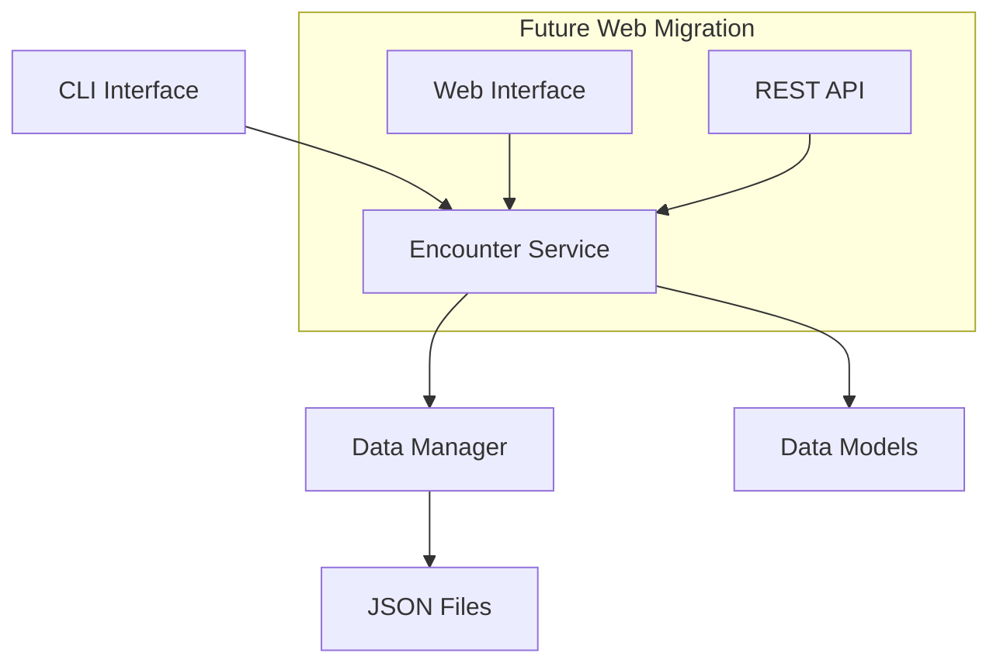

# Design Document

## Overview

The D&D Encounter Tracker is designed as a modular command-line application with a clear separation between business logic and user interface. This architecture enables future migration to a web application by keeping the core encounter management logic independent of the CLI interface.

The application follows a layered architecture pattern with distinct separation of concerns:
- **CLI Layer**: Handles user interaction and command parsing
- **Service Layer**: Contains business logic for encounter management
- **Data Layer**: Manages persistence and data serialization
- **Model Layer**: Defines data structures and validation

## Architecture

### High-Level Architecture



### Component Structure

```
dnd_encounter_tracker/
├── cli/
│   ├── __init__.py
│   ├── main.py           # Entry point and argument parsing
│   ├── commands.py       # CLI command handlers
│   └── display.py        # Output formatting and display
├── core/
│   ├── __init__.py
│   ├── models.py         # Data models (Combatant, Encounter)
│   ├── encounter.py      # Encounter management service
│   └── exceptions.py     # Custom exceptions
├── data/
│   ├── __init__.py
│   ├── persistence.py    # File I/O and serialization
│   └── validation.py     # Data validation utilities
└── main.py              # Application entry point
```

## Components and Interfaces

### Data Models

#### Combatant Model
```python
@dataclass
class Combatant:
    name: str
    max_hp: int
    current_hp: int
    initiative: int
    notes: List[str] = field(default_factory=list)
    combatant_type: str = "unknown"  # "player", "monster", "npc"
    
    def update_hp(self, value: str) -> None
    def add_note(self, note: str) -> None
    def remove_note(self, index: int) -> None
    def is_alive(self) -> bool
```

#### Encounter Model
```python
@dataclass
class Encounter:
    name: str
    combatants: List[Combatant] = field(default_factory=list)
    current_turn: int = 0
    round_number: int = 1
    
    def add_combatant(self, combatant: Combatant) -> None
    def remove_combatant(self, name: str) -> None
    def sort_by_initiative(self) -> None
    def next_turn(self) -> Combatant
    def get_current_combatant(self) -> Combatant
```

### Service Layer

#### EncounterService
The core business logic component that manages encounter operations:

```python
class EncounterService:
    def __init__(self, data_manager: DataManager):
        self.data_manager = data_manager
        self.current_encounter: Optional[Encounter] = None
    
    def create_encounter(self, name: str) -> Encounter
    def load_encounter(self, filename: str) -> Encounter
    def save_encounter(self, filename: str) -> None
    def add_combatant(self, name: str, hp: int, initiative: int, 
                     combatant_type: str = "unknown") -> None
    def update_hp(self, combatant_name: str, hp_change: str) -> None
    def adjust_initiative(self, combatant_name: str, new_initiative: int) -> None
    def add_note(self, combatant_name: str, note: str) -> None
    def get_initiative_order(self) -> List[Combatant]
```

### Data Layer

#### DataManager
Handles all file I/O operations and data serialization:

```python
class DataManager:
    def save_to_file(self, encounter: Encounter, filename: str) -> None
    def load_from_file(self, filename: str) -> Encounter
    def validate_file_format(self, filename: str) -> bool
    def get_available_encounters(self) -> List[str]
```

#### JSON Schema
Encounters are stored in JSON format for easy parsing and future web compatibility:

```json
{
    "name": "Goblin Ambush",
    "combatants": [
        {
            "name": "Thorin",
            "max_hp": 45,
            "current_hp": 32,
            "initiative": 18,
            "notes": ["Blessed by cleric", "Has inspiration"],
            "combatant_type": "player"
        }
    ],
    "current_turn": 0,
    "round_number": 3,
    "metadata": {
        "created": "2025-06-30T10:30:00Z",
        "last_modified": "2025-06-30T11:15:00Z",
        "version": "1.0"
    }
}
```

### CLI Layer

#### Command Interface
The CLI uses Python's `argparse` for robust command-line parsing with subcommands:

```python
# Main commands structure
parser = argparse.ArgumentParser(description='D&D Encounter Tracker')
subparsers = parser.add_subparsers(dest='command')

# Encounter management
new_parser = subparsers.add_parser('new', help='Create new encounter')
load_parser = subparsers.add_parser('load', help='Load encounter from file')
save_parser = subparsers.add_parser('save', help='Save current encounter')

# Combatant management  
add_parser = subparsers.add_parser('add', help='Add combatant')
hp_parser = subparsers.add_parser('hp', help='Update hit points')
init_parser = subparsers.add_parser('init', help='Adjust initiative')

# Display and utility
show_parser = subparsers.add_parser('show', help='Display encounter')
note_parser = subparsers.add_parser('note', help='Manage notes')
```

#### Display Manager
Handles formatted output for different views:

```python
class DisplayManager:
    def show_encounter_summary(self, encounter: Encounter) -> None
    def show_initiative_order(self, combatants: List[Combatant]) -> None
    def show_combatant_details(self, combatant: Combatant) -> None
    def show_help(self, command: str = None) -> None
```

## Data Models

### Hit Point Management
The system supports three types of HP updates:
- **Absolute**: `hp thorin 25` sets HP to 25
- **Addition**: `hp thorin +8` adds 8 HP
- **Subtraction**: `hp thorin -12` subtracts 12 HP

HP validation ensures values don't go below 0 or above maximum HP.

### Initiative System
- Combatants are automatically sorted by initiative (highest first)
- Manual initiative adjustment triggers automatic re-sorting
- Tie-breaking allows manual reordering of same-initiative combatants

### Notes System
- Each combatant maintains a list of notes
- Notes support free-form text for tracking status effects, spells, tactical information
- Notes are indexed for easy removal/editing

## Error Handling

### Exception Hierarchy
```python
class EncounterTrackerError(Exception):
    """Base exception for encounter tracker"""

class CombatantNotFoundError(EncounterTrackerError):
    """Raised when combatant doesn't exist"""

class InvalidHPValueError(EncounterTrackerError):
    """Raised for invalid HP modifications"""

class FileFormatError(EncounterTrackerError):
    """Raised for invalid file formats"""

class EncounterNotLoadedError(EncounterTrackerError):
    """Raised when no encounter is active"""
```

### Error Handling Strategy
- **Graceful Degradation**: Invalid input shows helpful error messages without crashing
- **Input Validation**: All user input is validated before processing
- **File Safety**: Backup creation before overwriting existing files
- **Recovery**: Corrupted files are detected and reported with recovery suggestions

## Testing Strategy

### Unit Testing
- **Model Tests**: Validate data model behavior and constraints
- **Service Tests**: Test business logic with mock data layer
- **Data Tests**: Verify serialization/deserialization accuracy
- **CLI Tests**: Test command parsing and output formatting

### Integration Testing
- **End-to-End Workflows**: Complete encounter creation, modification, and saving
- **File I/O Testing**: Save/load cycles with various data scenarios
- **Error Scenarios**: Invalid input handling and recovery

### Test Structure
```
tests/
├── unit/
│   ├── test_models.py
│   ├── test_encounter_service.py
│   ├── test_data_manager.py
│   └── test_cli_commands.py
├── integration/
│   ├── test_encounter_workflows.py
│   └── test_file_operations.py
└── fixtures/
    ├── sample_encounters/
    └── test_data.json
```

### Testing Framework
- **pytest**: Primary testing framework for its flexibility and fixtures
- **pytest-mock**: For mocking file I/O and external dependencies
- **pytest-cov**: Code coverage reporting to ensure comprehensive testing

## Future Web Migration Considerations

### Architecture Benefits
- **Separation of Concerns**: Business logic is independent of CLI interface
- **JSON Data Format**: Web-friendly serialization format
- **Service Layer**: Can be directly adapted for REST API endpoints
- **Modular Design**: Components can be reused in web application

### Migration Path
1. **Phase 1**: Extract service layer into shared library
2. **Phase 2**: Create REST API wrapper around service layer
3. **Phase 3**: Build web frontend consuming the API
4. **Phase 4**: Add real-time features (WebSocket for live updates)

### Web-Specific Enhancements
- **Database Integration**: Replace JSON files with proper database
- **User Authentication**: Multi-user support with session management
- **Real-time Updates**: Live encounter sharing between DM and players
- **Enhanced UI**: Rich web interface with drag-drop initiative management